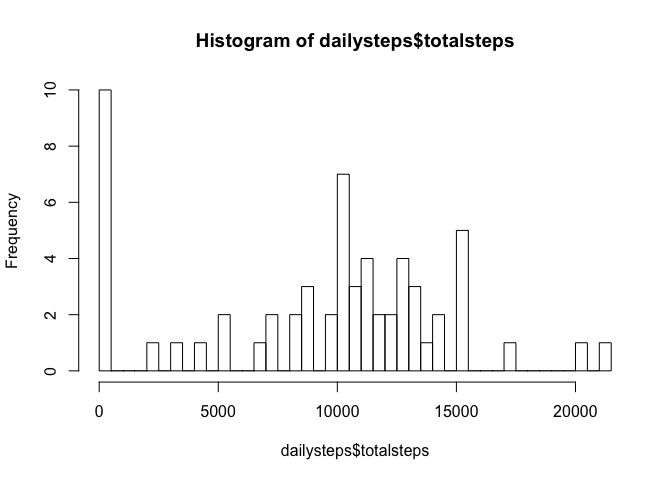
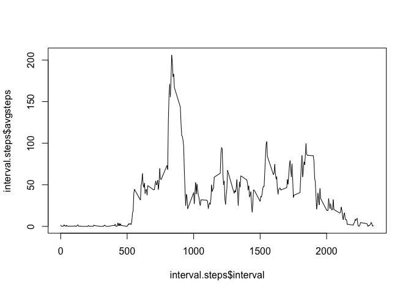
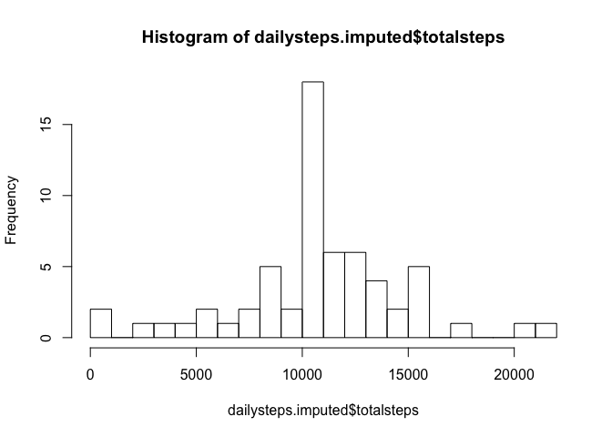
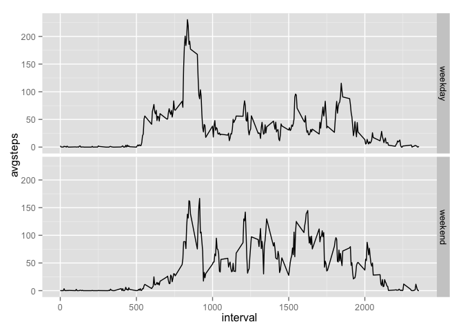

# Reproducible Research: Peer Assessment 1

## Introduction (copied from assignment)
It is now possible to collect a large amount of data about personal movement using activity monitoring devices such as a Fitbit, Nike Fuelband, or Jawbone Up. These type of devices are part of the "quantified self" movement -- a group of enthusiasts who take measurements about themselves regularly to improve their health, to find patterns in their behavior, or because they are tech geeks. But these data remain under-utilized both because the raw data are hard to obtain and there is a lack of statistical methods and software for processing and interpreting the data.

This assignment makes use of data from a personal activity monitoring device. This device collects data at 5 minute intervals through out the day. The data consists of two months of data from an anonymous individual collected during the months of October and November, 2012 and include the number of steps taken in 5 minute intervals each day.

## Loading and preprocessing the data


```r
library(ggplot2)
library(plyr)
data = read.csv( unzip( "activity.zip" ))
summary(data)
```

```
##      steps                date          interval     
##  Min.   :  0.00   2012-10-01:  288   Min.   :   0.0  
##  1st Qu.:  0.00   2012-10-02:  288   1st Qu.: 588.8  
##  Median :  0.00   2012-10-03:  288   Median :1177.5  
##  Mean   : 37.38   2012-10-04:  288   Mean   :1177.5  
##  3rd Qu.: 12.00   2012-10-05:  288   3rd Qu.:1766.2  
##  Max.   :806.00   2012-10-06:  288   Max.   :2355.0  
##  NA's   :2304     (Other)   :15840
```

```r
#dailysteps = by( data[,"steps"], INDICES = data[,"date"], FUN = sum )

dailysteps = ddply(data, ~date, summarise, totalsteps = sum(steps, na.rm=T))

#interval.steps = by( data[,"steps"], INDICES = data[,"interval"], FUN = mean, na.rm=T )

interval.steps = ddply(data, ~interval, summarise, avgsteps = mean(steps, na.rm=T))
```

These data are for the following date range:

```r
print( paste0( min(as.Date(data$date)), " to ", max(as.Date(data$date)) ))
```

```
## [1] "2012-10-01 to 2012-11-30"
```

## What is mean total number of steps taken per day?
For this part of the assignment, you can ignore the missing values in the dataset.

Make a histogram of the total number of steps taken each day

```r
hist(dailysteps$totalsteps, breaks = 50)
```

 

Calculate and report the mean and median total number of steps taken per day

```r
mean(dailysteps$totalsteps, na.rm = T)
```

```
## [1] 9354.23
```

```r
median(dailysteps$totalsteps, na.rm = T)
```

```
## [1] 10395
```

## What is the average daily activity pattern?
Make a time series plot (i.e. type = "l") of the 5-minute interval (x-axis) and the average number of steps taken, averaged across all days (y-axis)

```r
plot(x = interval.steps$interval, y = interval.steps$avgsteps, type="l")
```

 

Much of the activity is concentrated in the morning hours after waking around 5:45am.  The high average number of steps during the 8am - 9am hour suggests a fairly regular burst of activity during this time.  

There are also peaks of activity around the noon lunch hour, and in the early evening.  

Which 5-minute interval, on average across all the days in the dataset, contains the maximum number of steps?

```r
print( paste0("The maximum average steps in a 5 minute interval is: ",
              round( max(interval.steps$avgsteps), 0)))
```

```
## [1] "The maximum average steps in a 5 minute interval is: 206"
```

```r
print( paste0("The interval with this maximum is: ", 
              interval.steps[interval.steps$avgsteps == max(interval.steps$avgsteps), 1]))
```

```
## [1] "The interval with this maximum is: 835"
```

## Imputing missing values
Note that there are a number of days/intervals where there are missing values (coded as NA). The presence of missing days may introduce bias into some calculations or summaries of the data.

Calculate and report the total number of missing values in the dataset (i.e. the total number of rows with NAs)

```r
sum(!complete.cases(data))
```

```
## [1] 2304
```

```r
# note that this matches the number of NA's reported in summary(data) earlier.
```

Devise a strategy for filling in all of the missing values in the dataset. The strategy does not need to be sophisticated. For example, you could use the mean/median for that day, or the mean for that 5-minute interval, etc.

Create a new dataset that is equal to the original dataset but with the missing data filled in.

```r
# Replace steps = NA values with rounded mean for the interval
data.imputed = merge(x = data, y = interval.steps, by = "interval", all.x = "TRUE")
data.imputed[is.na(data.imputed$steps), 2] = round(data.imputed[is.na(data.imputed$steps), 4], 0)
```

Make a histogram of the total number of steps taken each day and Calculate and report the mean and median total number of steps taken per day. 

```r
dailysteps.imputed = ddply(data.imputed, ~date, summarise, totalsteps = sum(steps))

hist(dailysteps.imputed$totalsteps, breaks = 20)
```

 

```r
mean(dailysteps.imputed$totalsteps, na.rm = T)
```

```
## [1] 10765.64
```

```r
median(dailysteps.imputed$totalsteps, na.rm = T)
```

```
## [1] 10762
```

Do these values differ from the estimates from the first part of the assignment? 

Yes.


```r
print( paste0("Mean: ", mean(dailysteps$totalsteps, na.rm = T)))
```

```
## [1] "Mean: 9354.22950819672"
```

```r
print( paste0("Mean (imputed): ", mean(dailysteps.imputed$totalsteps, na.rm = T)))
```

```
## [1] "Mean (imputed): 10765.6393442623"
```

```r
print( paste0("Median: ", median(dailysteps$totalsteps, na.rm = T)))
```

```
## [1] "Median: 10395"
```

```r
print( paste0("Median (imputed): ", median(dailysteps.imputed$totalsteps, na.rm = T)))
```

```
## [1] "Median (imputed): 10762"
```

What is the impact of imputing missing data on the estimates of the total daily number of steps?

The average and median daily steps increase slightly when data are imputed.  The number of days with 0 total steps reported drops from 8 to 0, implying that there are several days where the data were not recorded (i.e., all NAs in every interval) and only imputed values were used to compute the daily total.  In addition, days with partial data now report a higher number of total steps.


## Are there differences in activity patterns between weekdays and weekends?
For this part the weekdays() function may be of some help here. Use the dataset with the filled-in missing values for this part.

Create a new factor variable in the dataset with two levels -- "weekday" and "weekend" indicating whether a given date is a weekday or weekend day.

```r
data.imputed$dow = weekdays(as.Date(data.imputed$date))
data.imputed$wd = "weekday"

data.imputed[ data.imputed$dow == "Saturday" | data.imputed$dow == "Sunday", 6] = "weekend"
```

Make a panel plot containing a time series plot (i.e. type = "l") of the 5-minute interval (x-axis) and the average number of steps taken, averaged across all weekday days or weekend days (y-axis). 


```r
interval.steps.imputed = 
    ddply(data.imputed, .(interval, wd), summarise, avgsteps = mean(steps, na.rm=T))

ggplot(data = interval.steps.imputed, aes(x = interval, y = avgsteps)) +
    geom_line() + 
    facet_grid(wd ~ .)
```

 
